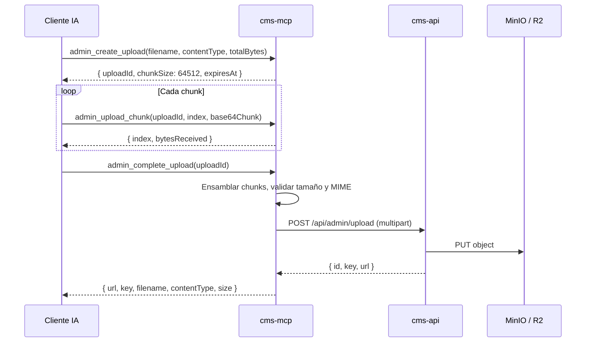

# cms-mcp

> **MCP Server para MacarenoNet CMS**  
> Expone herramientas de lectura (públicas) y administración del CMS via stdio o HTTP/SSE.

[](https://nodejs.org)
[](https://typescriptlang.org)
[](https://modelcontextprotocol.io)
[](https://docker.com)

---

## 📋 Tabla de Contenidos

- [Arquitectura](#-arquitectura)
- [Herramientas](#-herramientas)
- [Uso](#-uso)
- [Configuración](#-configuración)
- [Modos de ejecución](#-modos-de-ejecución)
- [Docker y producción](#-docker-y-producción)

---

## 🏗️ Arquitectura

```
cms-mcp/
├── src/
│   ├── index.ts                 ← Entry point stdio (local / Claude Desktop / Cursor)
│   ├── http.ts                  ← Entry point HTTP/SSE (producción VPS)
│   ├── create-server.ts         ← Factory del McpServer (compartido entre stdio y HTTP)
│   ├── cms-client.ts            ← Cliente HTTP para cms-api (público + admin con JWT)
│   └── upload-session.ts        ← Gestor de sesiones de subida por chunks
├── Dockerfile                   ← Multi-stage build (builder → runner)
├── docker-compose.prod.yml      ← Producción local (referencia)
└── tsconfig.json                ← TypeScript config (ES2022, Node16)
```

**Flujo de llamadas:**

```
Cliente MCP (Copilot, Claude, Cursor)
    │
    ├─ ▶ stdio ──→ index.ts ──→ create-server.ts ──→ cms-client.ts ──→ cms-api (HTTP)
    │
    └─ ▶ HTTP/SSE ──→ http.ts ──→ create-server.ts ──→ cms-client.ts ──→ cms-api (HTTP)
```

- **stdio**: Ideal para clientes de escritorio (Claude Desktop, Cursor local)
- **HTTP/SSE**: Ideal para entornos cloud (VS Code Copilot remoto, Cline, Continue)
- El servidor se autentica contra `cms-api` usando JWT con retry automático y refresh de token expirado

---

## 🛠️ Herramientas

### 🌐 Públicas (sin autenticación)

| Herramienta | Descripción |
|-------------|-------------|
| `list_articles` | Listar artículos publicados con filtros (locale, featured, search) |
| `get_article` | Obtener un artículo por slug + locale (con fallback a español) |

### 🔒 Admin (requiere `CMS_ADMIN_EMAIL` + `CMS_ADMIN_PASSWORD`)

| Herramienta | Descripción |
|-------------|-------------|
| `admin_list_articles` | Listar todos los artículos (incluye borradores) con filtros |
| `admin_get_article` | Obtener artículo por ID numérico |
| `admin_create_article` | Crear un artículo (o traducción vinculada por `documentId`) |
| `admin_update_article` | Actualizar campos de un artículo por ID |
| `admin_publish_article` | Publicar o despublicar por ID |
| `admin_delete_article` | Eliminar permanentemente por ID |
| `admin_list_authors` | Listar todos los autores |
| `admin_list_categories` | Listar todas las categorías (todos los locales) |
| `admin_list_subscribers` | Listar suscriptores del newsletter |
| `admin_likes_stats` | Estadísticas de likes (total + top artículos) |
| `admin_generate_image` | Generar imagen con Gemini AI desde un prompt de texto |
| `admin_delete_media` | Eliminar un archivo multimedia por ID (útil en flujos de aprobación) |

### 📤 Subida de imágenes (admin)

| Herramienta | Descripción |
|-------------|-------------|
| `admin_upload_image` | Subir imagen desde una ruta de archivo local (solo modo stdio) |
| `admin_upload_image_base64` | Subir imagen desde base64 / data URI. Máx **5 MB** |
| `admin_upload_image_from_url` | Descargar imagen de URL HTTPS pública y subir al bucket. SSRF-safe. Máx 10 MB |
| `admin_create_upload` | Iniciar sesión de subida fragmentada para archivos > 5 MB (máx **10 MB**) |
| `admin_upload_chunk` | Enviar un chunk codificado en base64. Idempotente |
| `admin_complete_upload` | Finalizar subida fragmentada — ensambla, valida MIME, sube a S3 |
| `admin_abort_upload` | Cancelar subida fragmentada y liberar almacenamiento |

> Todas las herramientas de subida devuelven `{ id, key, url }`. Usa `url` como `bgImageUrl` al crear o actualizar un artículo.

### 🔄 Flujo de subida fragmentada (chunked upload)



| Parámetro | Valor |
|-----------|-------|
| `chunkSize` | 64,512 bytes (divisible por 3 → base64 limpio) |
| Máx por chunk | 256 KB decodificados |
| Máx total | 10 MB |
| TTL de sesión | 1 hora |

> 💡 Como `chunkSize` (64512) es divisible por 3, también puedes dividir un string base64 completo en posiciones múltiplo de `64512 / 3 × 4 = 86016` caracteres.

---

## 🚀 Uso

### 🌐 Remoto HTTP/SSE (VS Code Copilot, Cursor, Continue, Cline)

Sin instalación — solo apunta al endpoint de producción:

```json
{
  "mcpServers": {
    "cms": {
      "url": "https://mcp.macareno.net/mcp"
    }
  }
}
```

✅ Funciona para todas las herramientas públicas.  
✅ Las herramientas admin funcionan automáticamente (credenciales del lado del servidor).

### 🖥️ Local stdio (Claude Desktop, asistentes locales)

**Opción 1 — npx (recomendado, sin clonar):**

```json
{
  "mcpServers": {
    "cms": {
      "command": "npx",
      "args": ["github:MacarenoNET/cms-mcp"],
      "env": {
        "CMS_API_URL": "https://api.macareno.net",
        "CMS_ADMIN_EMAIL": "admin@macareno.net",
        "CMS_ADMIN_PASSWORD": "your-password"
      }
    }
  }
}
```

**Opción 2 — Clonar y ejecutar localmente:**

```bash
git clone https://github.com/MacarenoNET/cms-mcp.git
cd cms-mcp
npm install
npm run build
```

Configurar en el cliente:

```json
{
  "mcpServers": {
    "cms": {
      "command": "node",
      "args": ["ruta/a/cms-mcp/dist/index.js"],
      "env": {
        "CMS_API_URL": "https://api.macareno.net",
        "CMS_ADMIN_EMAIL": "admin@macareno.net",
        "CMS_ADMIN_PASSWORD": "your-password"
      }
    }
  }
}
```

---

## ⚙️ Configuración

### Variables de entorno

| Variable | Requerida | Descripción |
|----------|-----------|-------------|
| `CMS_API_URL` | **Sí** | URL base de cms-api (ej: `https://api.macareno.net`) |
| `CMS_ADMIN_EMAIL` | Admin tools | Email del admin para autenticación JWT |
| `CMS_ADMIN_PASSWORD` | Admin tools | Contraseña del admin |
| `PORT` | No | Puerto para modo HTTP (default: `3020`) |

### 📋 Ubicación de archivos de configuración por cliente

| Cliente | Archivo |
|---------|---------|
| VS Code Copilot | `.vscode/mcp.json` |
| Cursor | `.cursor/mcp.json` |
| Cline | VS Code settings → `cline.mcpServers` |
| Continue.dev | `~/.continue/config.json` |
| Claude Desktop | `%APPDATA%\Claude\claude_desktop_config.json` |

---

## 🖥️ Modos de ejecución

### stdio (entrada/salida estándar)

```bash
npm run build
npm start
# o directamente:
node dist/index.js
```

Usa `StdioServerTransport` del MCP SDK. Ideal para Claude Desktop, Cursor local y asistentes que se comunican por stdio.

### HTTP/SSE (servidor web)

```bash
npm run build
npm run start:http
# → Servidor en http://localhost:3020
# → Endpoint MCP: http://localhost:3020/mcp
# → Health check: http://localhost:3020/health
```

Usa `StreamableHTTPServerTransport` del MCP SDK. Una sesión por request (stateless). Ideal para entornos cloud.

---

## 🐳 Docker y producción

### Dockerfile — Multi-stage

| Stage | Base | Propósito |
|-------|------|-----------|
| `builder` | `node:20-alpine` | Compilación TypeScript |
| `runner` | `node:20-alpine` | Ejecución (`node dist/http.js`) |

### Construir y ejecutar

```bash
docker build -t cms-mcp .
docker run -p 3020:3020 \
  -e CMS_API_URL=https://api.macareno.net \
  -e CMS_ADMIN_EMAIL=admin@macareno.net \
  -e CMS_ADMIN_PASSWORD=your-password \
  cms-mcp
```

> ⚠️ En producción real, el servicio `cms-mcp` está integrado en el stack de `cms-api/docker-compose.prod.yml` con Traefik.

---

## 🔗 Repos relacionados

| Proyecto | Descripción |
|----------|-------------|
| [cms-api](https://github.com/MacarenoNET/cms-api) | Backend NestJS + Prisma + PostgreSQL |
| [cms-web](https://github.com/MacarenoNET/cms-web) | Blog público (Next.js) |
| [cms-admin](https://github.com/MacarenoNET/cms-admin) | Panel de administración (Next.js) |
| [cms-docs](https://github.com/MacarenoNET/cms-docs) | Documentación y skills del equipo |

---

## 📄 Licencia

Privado — MacarenoNet © 2026
